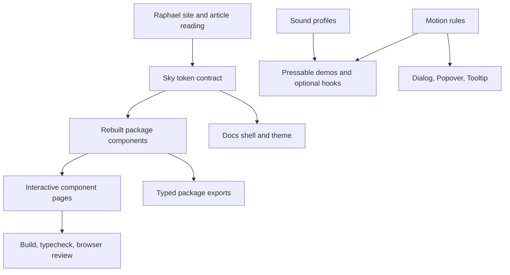

# feat: Rebuild Sky UI Library From Raphael Reference

## Summary

Rebuild the Sky / `@gulaab/ui` component library and docs from a fresh component list shaped by Raphael Salaja's site, articles, and audio work. The target is a restrained light-first system with sky-blue component accents, tactile motion, optional subtle sound, and simpler docs that let the components carry the brand.

---

## Problem Frame

The current branch has grown from a button-focused library into a broad component set, but the visual system is still rose-accented, partly docs-owned, and inconsistent across interaction surfaces. The user wants a full remake: not a polish pass over the existing components, but a new library identity and component inventory based on Raphael Salaja's craft language.

The accessible Raphael source material emphasizes restraint, craft, originality, purposeful motion, and sound as secondary feedback. Draft homepage entries are visible but not readable, so this plan uses the published articles, homepage structure, work links, and `@web-kits/audio` documentation as the external basis.

---

## Requirements

**Design Source and Identity**

- R1. The library must be rebuilt around a fresh Sky visual language, not the current rose Gulaab styling.
- R2. The reference reading must preserve Raphael's lessons: restrained UI, high craft, originality over mimicry, motion with intent, and sound as supporting feedback.
- R3. The default theme must be light with an off-white background, an almost-black dark mode, and a sky-blue primary accent used by UI components only.
- R4. Docs chrome, page headings, navigation, and explanatory copy must avoid accent color except for the logo and component demonstrations.

**Component System**

- R5. The component list must be remade from scratch and treated as a product decision, not a continuation of the current sidebar order.
- R6. Components must share semantic tokens for color, radius, spacing, elevation, focus, motion, and sound.
- R7. Pressable components must include tactile feedback: active scale, focus/active darken in light mode, focus/active brighten in dark mode, and reduced-motion fallbacks.
- R8. Overlay components must use purposeful staging: backdrop first, panel second, focus target third where applicable.
- R9. Sound must be opt-in or user-disableable, use one reused audio context, respect reduced motion and touch contexts, and never fire for high-frequency typing or keyboard navigation.

**Docs and Verification**

- R10. The docs site must become a wider, simpler component gallery with reusable page scaffolding and consistent examples.
- R11. Each shipped component page must show default, variants, sizes, states, accessibility notes, motion notes, and sound behavior when relevant.
- R12. The package must continue to build as a React library with typed exports, and the docs app must consume the rebuilt package without private imports.

---

## Key Technical Decisions

- KTD1. **Treat this as a replacement, not an incremental theme patch:** The user explicitly asked to remake the UI library, components, and component list from scratch, so implementation should replace conflicting current choices instead of adding compatibility shims around in-progress branch work.
- KTD2. **Move shared design contract into the package:** `packages/ui` should own CSS tokens and component-level behavior so the docs app demonstrates the library instead of secretly defining it in `apps/docs/app/globals.css`.
- KTD3. **Use native CSS for core motion:** Raphael's animation guidance and the current dependency set both support CSS transitions for interruptible state changes. Keep `motion` only for examples or interaction islands that need springs.
- KTD4. **Keep Radix for accessible overlays:** Existing `Dialog`, `Popover`, and `Tooltip` use Radix primitives. Rebuild their styling and animation contract, but preserve the accessibility foundation.
- KTD5. **Adopt a single sky accent family:** Replace rose/accent color variants with semantic `primary`, `neutral`, `danger`, and `warning` roles, where sky-blue is the only brand accent and non-primary roles are functional.
- KTD6. **Make sound a docs-level demo first, then a package primitive if clean:** The current sound helper lives in docs. Build a small, typed sound profile layer that can remain docs-only unless the package API stays simple and accessible.

---

## High-Level Technical Design

The implementation should flow from source reading to token contract, then component rebuild, then docs. This keeps the component list and behavior grounded before page-level decoration starts.

---

## New Component Inventory

The first rebuilt list should ship a coherent core rather than every possible primitive. The active docs sidebar should include:

- Button
- Icon Button
- Link Button
- Text Field
- Textarea
- Select
- Checkbox
- Switch
- Radio Group
- Slider
- Badge
- Avatar
- Kbd
- Tooltip
- Popover
- Dialog
- Tabs
- Spinner
- Progress
- Toast

Components not implemented in this pass may appear as disabled sidebar entries only if the docs make that status clear. Do not keep the old component list just because the files already exist.

---

## Implementation Units

### U1. Source Reading and Sky Token Contract

- **Goal:** Capture the new design contract as package-owned CSS tokens and remove docs-only rose defaults.
- **Requirements:** R1, R2, R3, R4, R6
- **Dependencies:** none
- **Files:** `packages/ui/src/styles.css`, `packages/ui/package.json`, `packages/ui/tsup.config.ts`, `apps/docs/app/globals.css`, `apps/docs/app/layout.tsx`
- **Approach:** Add semantic Sky tokens for background, text, borders, focus, elevation, primary sky, danger, warning, durations, easing, and component radii. Keep the docs app responsible for page layout and font loading, but import package styles so demos use the same contract consumers receive.
- **Patterns to follow:** Existing CSS variable usage in `apps/docs/app/globals.css`; Tailwind v4 `@source` usage; package export shape in `packages/ui/package.json`.
- **Test scenarios:** Verify light mode uses off-white page background and sky-blue component accent. Verify dark mode uses near-black backgrounds and preserves contrast. Verify package styles build into `./styles` export.
- **Verification:** The package and docs build with the new style entry, and no component depends on rose-specific tokens.

### U2. Rebuild Pressable Foundations

- **Goal:** Rebuild Button, Icon Button, Link Button, and shared pressable behavior around the new token and motion rules.
- **Requirements:** R3, R4, R6, R7, R9, R12
- **Dependencies:** U1
- **Files:** `packages/ui/src/components/Button/Button.tsx`, `packages/ui/src/components/Button/index.ts`, `packages/ui/src/components/IconButton/IconButton.tsx`, `packages/ui/src/components/IconButton/index.ts`, `packages/ui/src/components/LinkButton/LinkButton.tsx`, `packages/ui/src/components/LinkButton/index.ts`, `packages/ui/src/index.ts`, `apps/docs/components/SoundButton.tsx`, `apps/docs/hooks/useSound.ts`
- **Approach:** Replace rose/color-heavy variants with a smaller set: `solid`, `soft`, `outline`, `ghost`, and `link`, backed by semantic color roles. Press feedback should scale around `0.96-0.97`, transition exact properties only, and expose loading states without layout jumps.
- **Patterns to follow:** `Slot` / `asChild` support from current Button; `make-interfaces-feel-better` rules for specific transitions and hit areas; Raphael's 12 Principles article for timing under 300ms and secondary sound.
- **Test scenarios:** Click and keyboard activate each button variant. Confirm loading state disables interaction, keeps label readable, and animates without width snap. Confirm focus and active darken in light mode and brighten in dark mode. Confirm disabled state stays readable and non-interactive.
- **Verification:** Pressable exports are typed, docs examples render all variants, and sound never fires for disabled actions.

### U3. Rebuild Form Controls

- **Goal:** Rebuild Text Field, Textarea, Select, Checkbox, Switch, Radio Group, and Slider with consistent labels, helper text, error text, focus, and motion.
- **Requirements:** R3, R6, R7, R11, R12
- **Dependencies:** U1, U2
- **Files:** `packages/ui/src/components/Input/Input.tsx`, `packages/ui/src/components/Textarea/Textarea.tsx`, `packages/ui/src/components/Select/Select.tsx`, `packages/ui/src/components/Checkbox/Checkbox.tsx`, `packages/ui/src/components/Toggle/Toggle.tsx`, `packages/ui/src/components/RadioGroup/RadioGroup.tsx`, `packages/ui/src/components/Slider/Slider.tsx`, matching `index.ts` files, `packages/ui/src/index.ts`, `apps/docs/app/input/page.tsx`, `apps/docs/app/checkbox/page.tsx`, `apps/docs/app/select/page.tsx`, `apps/docs/app/toggle/page.tsx`
- **Approach:** Rename the public "Toggle" docs concept to "Switch" if the component behaves like a switch. Use above-input labels, real helper/error descriptions, and native inputs where possible. Use Radix only if an accessible custom primitive is needed.
- **Patterns to follow:** Current controlled/uncontrolled patterns in `Checkbox` and `Toggle`; design-taste rule that placeholder-as-label is never acceptable.
- **Test scenarios:** Verify controlled and uncontrolled checkbox/switch/radio usage. Verify labels associate with controls. Verify error text sets `aria-invalid` and `aria-describedby`. Verify reduced motion removes nonessential transform motion while preserving state clarity.
- **Verification:** Form controls expose typed props, docs cover default/error/disabled states, and keyboard interaction matches native expectations.

### U4. Rebuild Display and Feedback Components

- **Goal:** Rebuild Badge, Avatar, Kbd, Spinner, Progress, and Toast around the Sky visual language and component list.
- **Requirements:** R3, R5, R6, R7, R11, R12
- **Dependencies:** U1
- **Files:** `packages/ui/src/components/Badge/Badge.tsx`, `packages/ui/src/components/Avatar/Avatar.tsx`, `packages/ui/src/components/Kbd/Kbd.tsx`, `packages/ui/src/components/Spinner/Spinner.tsx`, `packages/ui/src/components/Progress/Progress.tsx`, `packages/ui/src/components/Toast/Toast.tsx`, matching `index.ts` files, `packages/ui/src/index.ts`, `apps/docs/app/badge/page.tsx`, `apps/docs/app/avatar/page.tsx`, `apps/docs/app/kbd/page.tsx`, new docs pages for spinner/progress/toast`
- **Approach:** Use Sky tokens for state roles without making every status look branded. Spinner and Progress should feel fast and precise; Toast can be a lightweight component or deferred if the package surface grows too large during implementation.
- **Patterns to follow:** Existing Avatar fallback behavior; `userinterface-wiki` timing rules for loading/perceived performance; tabular number guidance for progress values.
- **Test scenarios:** Verify Avatar image fallback on error. Verify Badge roles pass contrast. Verify Spinner is aria-hidden when decorative and labelled when meaningful. Verify Progress exposes accessible value semantics. Verify Toast does not trap focus and can be dismissed.
- **Verification:** Display components render in docs in both themes and package exports remain coherent.

### U5. Rebuild Overlays and Staged Motion

- **Goal:** Rebuild Tooltip, Popover, Dialog, and Tabs with origin-aware or staged motion.
- **Requirements:** R6, R7, R8, R11, R12
- **Dependencies:** U1, U2
- **Files:** `packages/ui/src/components/Tooltip/Tooltip.tsx`, `packages/ui/src/components/Popover/Popover.tsx`, `packages/ui/src/components/Dialog/Dialog.tsx`, `packages/ui/src/components/Tabs/Tabs.tsx`, matching `index.ts` files, `packages/ui/src/index.ts`, `apps/docs/app/tooltip/page.tsx`, `apps/docs/app/popover/page.tsx`, `apps/docs/app/dialog/page.tsx`, new `apps/docs/app/tabs/page.tsx`
- **Approach:** Keep Radix roots where present. Set popover/tooltip transform origins from Radix variables, keep context-menu-like interactions fast, and stage dialog backdrop/content/focus without over-animating frequent actions.
- **Patterns to follow:** Current Radix primitive wrappers; Emil design guidance for popover transform-origin and tooltip timing.
- **Test scenarios:** Verify Escape closes overlays. Verify focus returns to trigger. Verify Popover scales from trigger and Dialog remains centered. Verify Tooltip delay does not make adjacent tooltips feel sluggish. Verify reduced motion avoids transform movement.
- **Verification:** Overlay examples work with keyboard and pointer input, and no animation exceeds 300ms for user-initiated UI.

### U6. Rebuild Docs Shell and Component Pages

- **Goal:** Replace the current one-off docs pages with a simple, wide, reusable component gallery.
- **Requirements:** R4, R5, R10, R11
- **Dependencies:** U1, U2, U3, U4, U5
- **Files:** `apps/docs/components/Sidebar.tsx`, `apps/docs/components/ThemeToggle.tsx`, `apps/docs/components/ComponentPage.tsx`, `apps/docs/components/Showcase.tsx`, `apps/docs/app/page.tsx`, all component page files under `apps/docs/app/*/page.tsx`
- **Approach:** Use a reusable page scaffold with short intros, sectioned examples, state rows, accessibility notes, and compact code hints only where they help. Keep the layout wider than the current `1100px`, remove bloat, and preserve the gradient Sky logo.
- **Patterns to follow:** Existing sidebar stickiness and theme toggle shortcut, but remove inline hover mutation patterns in favor of CSS classes and tokens.
- **Test scenarios:** Verify sidebar active state for each route. Verify disabled future entries cannot navigate. Verify theme persists and avoids flash. Verify each component page demonstrates default, variants, sizes, states, and accessibility notes.
- **Verification:** Docs build and pages are visually consistent in light and dark mode.

### U7. Package Exports, Build Hygiene, and Verification

- **Goal:** Keep the rebuilt library consumable and verify the package/docs integration.
- **Requirements:** R11, R12
- **Dependencies:** U1, U2, U3, U4, U5, U6
- **Files:** `packages/ui/src/index.ts`, `packages/ui/package.json`, `pnpm-lock.yaml`, docs/package metadata only if dependency changes are required
- **Approach:** Remove exports for components no longer shipped, add exports for new components, and keep dependencies minimal. Prefer existing Radix packages for overlays. Add new Radix dependencies only for controls that need them.
- **Patterns to follow:** Existing `@gulaab/ui` export shape and root scripts.
- **Test scenarios:** Verify TypeScript consumers can import every documented component from `@gulaab/ui`. Verify `@gulaab/ui/styles` resolves. Verify docs imports do not reach into package internals.
- **Verification:** Root typecheck/build completes, or any failure is documented with a concrete blocker.

---

## Scope Boundaries

### In Scope

- Replacing current rose accent choices with the Sky visual system.
- Rebuilding existing component implementations where they conflict with the new contract.
- Adding the first new components needed for the remade inventory.
- Reworking docs pages and sidebar to match the new component list.
- Using Raphael's site/articles/audio docs as inspiration and source material without copying the site.

### Deferred to Follow-Up Work

- A full public documentation content strategy beyond component docs.
- Publishing package release automation.
- Visual regression testing infrastructure.
- A full `@web-kits/audio` dependency integration if a small local sound layer is sufficient for this pass.

### Outside This Product's Identity

- Copying Raphael Salaja's website visual design one-to-one.
- Turning every interaction into an animation showcase.
- Using accent color for docs headings, nav, or page decoration outside the component surfaces.

---

## Risks and Dependencies

- The request is broad enough to exceed one clean PR if every listed component is fully rebuilt. If execution time runs short, prefer a complete token contract, pressable/form/overlay foundation, and honest disabled docs entries over many shallow components.
- Next 16 has repo-specific guidance to read local Next docs before relying on older Next conventions. Any routing or metadata changes should be checked against installed docs if behavior is unclear.
- Sound can become intrusive quickly. The default must stay subtle, user-controllable, and silent under reduced-motion or touch contexts.
- Some Raphael homepage library entries are drafts without accessible article pages. Do not infer detailed requirements from unreadable drafts.

---

## Sources and Research

- `https://www.raphaelsalaja.com/`: homepage, work links, published library entries, and draft titles.
- `https://www.raphaelsalaja.com/library/12-principles-of-animation`: motion as communication, under-300ms timing, staging, secondary action, sound as supportive feedback.
- `https://www.raphaelsalaja.com/library/the-concept-of-taste`: taste as trained fundamentals, hierarchy, composition, clarity, and reinvention.
- `https://www.raphaelsalaja.com/library/chasing-approval`: originality over approval chasing and mimicry.
- `https://www.raphaelsalaja.com/library/building-vs-banking`: build for craft and meaning, not surface metrics.
- `https://www.raphaelsalaja.com/library/white-tees`: restraint, quality, construction, and enduring basics as a metaphor for component fundamentals.
- `https://audio.raphaelsalaja.com/`: declarative sound definitions, subtle one-call playback, sound patches, and sound-as-interface reference.
- `docs/plans/plan1.md` and `docs/plans/plan2.md`: prior Sky/Gulaab notes about Swiss-level craft, off-white light theme, sky-blue primary, darker dark mode, simpler docs, gradient logo, and sound.
- `packages/ui/src/components/Button/Button.tsx`: current pressable API and loading pattern.
- `apps/docs/app/globals.css`: current docs-owned token layer that should move toward a package-owned contract.
- `apps/docs/components/Sidebar.tsx` and `apps/docs/components/ThemeToggle.tsx`: current docs shell patterns to preserve selectively.
